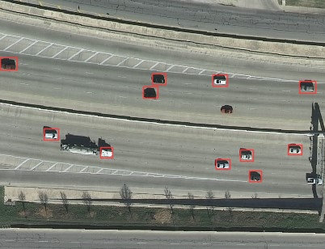

# TrafficDensityApp 

TrafficDensityApp es una aplicación diseñada con el propósito de ayudar a los ayuntamientos a que tengan un mayor control de la información de densidad de tráfico en sus respectivos municipios, a partir de unas imágenes aéreas de ciertas zonas de control. 

TrafficDensityApp hace uso de visión artificial para la detección de vehículos a partir de una imagen aérea. Esta aplicación, devuelve las posiciones de los vehículos, pudiendo estimar la densidad de vehículos en un área. 

 

  

# Instalación 

Para poder ejecutar nuestro software el usuario necesitará como mínimo las siguientes características: 

* Python3.6 o mayor 
* (opcional) CUDA 11.2 
* (opcional) Driver de CUDA (cuDNN): 460.27.04 o mayor 

El software se puede ejecutar en GPU instalando previamente las dependencias necesarias.

Los pasos necesarios para instalar la aplicación: 

**1.** Clonar el repositorio
~~~
git clone https://github.com/fkite-cs/TrafficDensityApp.git
~~~

**2.** Crear entorno virtual
~~~
python3 -m venv virtual_environment
source virtual_environment/bin/activate
~~~

**3.** Instalar librerías dentro del entorno
~~~
python -m pip install -r requirements.txt
~~~

Al terminar estos pasos, será capaz de ejecutar la demo de detección que se ha desarrollado. 

# Trabajos Futuros 

En las siguientes fases del proyecto se diseñarán e implementarán varias mejoras como: 

* Mapa de calor. Imagen con la cantidad de vehículos detectados representado en diferentes escalas de colores. 
* Detección de calles. Posibilidad de seleccionar diferentes calles, autopistas o cualquier vía pública para calcular su densidad de tráfico. 
* ✨✨✨ Interfaz gráfica. Elegante y fácil de usar. ✨✨✨
